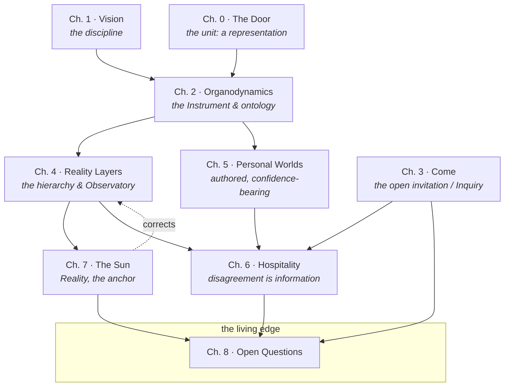

# The Brill Blueprint — Table of Contents

*The complete manuscript, front to back. This file doubles as an
[mdBook](https://rust-lang.github.io/mdBook/) `SUMMARY.md`: the nested list below is a valid
mdBook table of contents, so `mdbook build` works with no restructuring.*

---

## The knowledge map

How the chapters and the discipline's core concepts connect. Read it as the book's floor plan:
Reality anchors everything; the door is the unit; the Observatory watches; disagreement feeds
the whole.

---

## Front Matter

- [Title Page](front-matter/00-title.md)
- [Colophon — How this book was recovered](front-matter/01-colophon.md)
- [How to Read This Book](front-matter/02-how-to-read.md)
- [Preface — The Book That Already Existed](front-matter/03-preface.md)

## The Manuscript

- [Chapter 0 · The Door](manuscript/00-the-door.md) — *the representation as a door; you open one* · `▮`
- [Chapter 1 · Vision](manuscript/01-vision.md) — *an engineering discipline for evolving representations of reality* · `▮`
- [Chapter 2 · Organodynamics](manuscript/02-organodynamics.md) — *the Instrument and the ontology of kinds* · `▣`
- [Chapter 3 · Come](manuscript/03-come.md) — *the open invitation; the Inquiry* · `✎▸`
- [Chapter 4 · Reality Layers](manuscript/04-reality-layers.md) — *the hierarchy, the loop, the Observatory* · `▣`
- [Chapter 5 · Personal Worlds](manuscript/05-personal-worlds.md) — *authored claims; never measure the author* · `▮`
- [Chapter 6 · Hospitality](manuscript/06-hospitality.md) — *tension, and why disagreement is information* · `▣`
- [Chapter 7 · The Sun](manuscript/07-the-sun.md) — *Reality, the one thing nothing produces* · `▮`
- [Chapter 8 · Open Questions](manuscript/08-open-questions.md) — *the recovered frontier* · `▣`

## Appendices

- [Appendix A · RFC-001 · The Instrument (verbatim)](appendices/A-rfc-001-the-instrument.md)
- [Appendix B · RFC-002 · Inquiry (verbatim)](appendices/B-rfc-002-inquiry.md)
- [Appendix C · The Evolution of RFC-001 (the historical layer)](appendices/C-evolution-of-rfc-001.md)

## Apparatus

- [Glossary](apparatus/glossary.md)
- [References](apparatus/references.md)
- [Illustration Index](apparatus/illustration-index.md)
- [Editorial Notes](apparatus/editorial-notes.md)

## Editorial Dossier

*The reconstruction's working papers — how the book was recovered, mapped, and kept honest.*

- [1 · Repository Inventory](editorial/00-repository-inventory.md)
- [2 · Book Fragment Inventory](editorial/01-fragment-inventory.md)
- [3 · Canonical Source Map](editorial/02-canonical-source-map.md)
- [4 · Provenance Map](editorial/03-provenance-map.md)
- [5 · Editorial Report](editorial/04-editorial-report.md)
- [8 · Illustration Plan](editorial/05-illustration-plan.md)
- [9 · Visual Language Guide](editorial/06-visual-language-guide.md)
- [10 · Outstanding Gaps](editorial/07-outstanding-gaps.md)
- [11 · Future Editorial Recommendations](editorial/08-future-recommendations.md)

---

### The eleven deliverables, located

| # | Deliverable | Where |
|---|-------------|-------|
| 1 | Repository inventory | [editorial/00](editorial/00-repository-inventory.md) |
| 2 | Book fragment inventory | [editorial/01](editorial/01-fragment-inventory.md) |
| 3 | Canonical source map | [editorial/02](editorial/02-canonical-source-map.md) |
| 4 | Provenance map | [editorial/03](editorial/03-provenance-map.md) |
| 5 | Editorial report | [editorial/04](editorial/04-editorial-report.md) |
| 6 | Complete Table of Contents | **this file** |
| 7 | Reconstructed manuscript | [manuscript/](manuscript/) + front matter + appendices |
| 8 | Illustration plan | [editorial/05](editorial/05-illustration-plan.md) |
| 9 | Visual language guide | [editorial/06](editorial/06-visual-language-guide.md) |
| 10 | Outstanding gaps | [editorial/07](editorial/07-outstanding-gaps.md) |
| 11 | Future editorial recommendations | [editorial/08](editorial/08-future-recommendations.md) |
