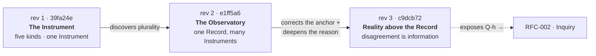

<!-- ▣ appendix C · the historical layer -->

# Appendix C — The Evolution of RFC-001

*The discipline documents its own creation. This appendix recovers the three revisions of
RFC-001 as a single story of a discipline changing its mind — twice by correction, once by
deepening — and keeping every earlier belief on the way.*

Nothing here is reconstructed guesswork: each change is recovered from the commit diffs in the
Record (`39fa24e` → `e1ff5a6` → `c9dcb72`). This is the book's **historical layer**, and it is
first-class content, not backmatter trivia. A discipline whose deepest rule is *keep what you
learn from* must show its own learning.

<!-- FIG-C.1 -->

---

## Revision 1 → Revision 2 — *The Observatory is discovered*

**Commit:** `e1ff5a6` — "Revise RFC-001 (rev 2): one Record, an Observatory of Instruments"

Revision 1 assumed there was **one** Instrument. Revision 2 discovered that assumption failed
the RFC's own test — a single instrument makes its theory of what matters invisible and total,
with no second vantage point to detect its blindness — and that the RFC had *already described
two instruments without noticing* (the declared and derived observables of §5.2, whose richest
reading is the gap between them: an inter-instrument comparison).

What changed:

| Aspect | Revision 1 believed | Revision 2 established |
|--------|--------------------|-----------------------|
| Number of Instruments | "**The** Instrument" — singular | Many — an **Observatory** |
| The unifying invariant | (implicit: the Instrument) | "The unity that matters is **the Record**" |
| Ontology | Five kinds, incl. "The Instrument" | Adds **The Observatory**; "Instruments" pluralized — the count of five *quietly broken* |
| New doctrine | — | §6: no aggregation; commissioning by challenge; "one sky, many telescopes" |
| Open questions | Q-a … Q-d | + Q-e (comparison protocol), Q-f (commissioning evidence), Q-g (minimum viable Observatory) |

> The self-similar move: a *comparator* of two Instruments' readings is itself just another
> function of the Record — another Instrument, not a higher kind. This is what keeps the
> Observatory **flat, not towered**, and it is the seed the book plants back in Chapter 0
> ("a claim about claims is still a door").

## Revision 2 → Revision 3 — *Reality above the Record; and a reason deepened*

**Commit:** `c9dcb72` — "Revise RFC-001 (rev 3): Reality above the Record; disagreement is
information"

Revision 3 accepted two challenges. The first was a **correction**; the second a **deepening**.

### Correction — the anchor was in the wrong place

Revision 2 had crowned the Record: "the unity that matters is the Record." Revision 3 accepted
that this violated the discipline's own constitutional asymmetry — *Reality is not negotiated;
representations are* — because the Record, for all its append-only rigor, is an **artifact**: a
representation of interactions with Reality, not the anchor itself.

| Aspect | Revision 2 believed | Revision 3 established |
|--------|--------------------|-----------------------|
| The deepest invariant | **The Record** | **Reality** — the Record demoted to artifact |
| The hierarchy | Record → Observatory → … | **Reality** → Record → Observatory → … |
| Geometry | (a stack) | **A loop, not a line** — Reality the one unproduced node |
| The Record's reliability | (uniform) | **Two zones**: constitutive (infallible about itself) vs testimony (only as good as its witnesses) |
| "One sky, many telescopes" | the sky *is* the Record | amended: "the sky was never the Record" |

### Deepening — why we refuse to aggregate

Revision 2 justified "no aggregation" **defensively** — as a guard against Goodhart. Revision 3
inverted the order of justification: the real reason is **constitutional**.

> **rev 2:** "No aggregation. … the royal road back past the Goodhart line."
> **rev 3:** "No aggregation — **because disagreement is information.** … Averaging destroys
> exactly the information the Observatory exists to produce. … Goodhart is merely what punishes
> the discipline that forgets this."

The change is not a reversal but a deepening: the same rule, re-founded on a positive principle
rather than a defensive one. It is the intellectual center of [Chapter 6](../manuscript/06-hospitality.md).

### And a question left home

Revision 3 also exposed **Q-h** — who composes the Observatory around a *live question* — and
moved it out into a new RFC, **RFC-002 · Inquiry**, which became [Chapter 3](../manuscript/03-come.md).
It added **Q-i**, the self-similarity question: no total vantage point at any scale, and a
warning that "a fixed roster of predictable voices is aggregation by another name."

---

## What the evolution teaches

Three of the book's load-bearing ideas are *products of revision*, not first drafts:

1. **The Observatory** (Chapter 4) exists because revision 2 refused to trust a lone instrument.
2. **Reality as the anchor** (Chapter 7) exists because revision 3 refused to let an artifact
   sit at the top.
3. **"Disagreement is information"** (Chapter 6) reached its full, constitutional form only in
   revision 3.

None of the earlier beliefs were deleted. The "five kinds" scar is left in the ontology on
purpose; the "unity is the Record" claim is preserved as a dated waypoint; the defensive framing
of aggregation stands beside the constitutional one. This is the discipline keeping faith with
its own promise — *the record keeps what it learns from* — and it is why this book never erases
what it used to believe.

---

### Provenance
- rev 1 → rev 2 diff — commits `39fa24e` → `e1ff5a6` (**EVO-1**).
- rev 2 → rev 3 diff — commits `e1ff5a6` → `c9dcb72` (**EVO-2**).
- Verbatim endpoints — [Appendix A](A-rfc-001-the-instrument.md) (rev 3), and the Record for
  rev 1 and rev 2.
