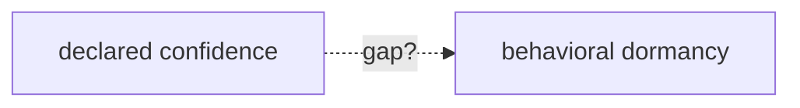
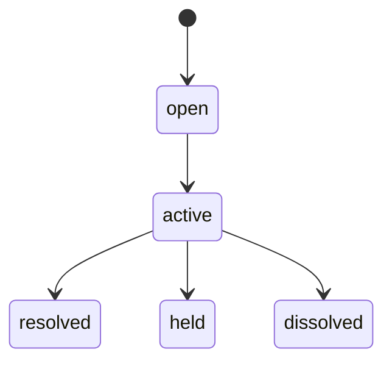

# Editorial Deliverable 9 — Visual Language Guide

*The visual design is part of the knowledge representation system. Design is semantic, not
decorative. This guide defines how a plain-text, version-controlled manuscript makes the
**maturity of an idea visible** — how it performs the transformation it describes.*

The Brill Blueprint is a book about knowledge maturing from guess to canon. The Chrysalis
Principle says the book must *itself* mature the same way — a research notebook at the
start, a formal specification at the end. In a Markdown repository we cannot use real
pencil and ink, so we encode the four stages with a small, strict vocabulary of text
conventions that render everywhere GitHub renders Markdown, and degrade gracefully in a
plain text editor.

---

## 1. The four stages and their glyphs

Every chapter, section, figure, and sidebar carries exactly one **maturity badge**. The
badge is the first thing on the element and is never omitted.

| Stage | Name | Glyph | The page says | Encoding register |
|-------|------|-------|---------------|-------------------|
| I | Discovery | `✎` | "We are discovering." | pencil: sketches, margin notes, erasures, arrows |
| II | Investigation | `✎▸` | "We believe this, but we are still testing." | pencil + ink: dashed diagrams, corrections shown |
| III | Validation | `▮` | "This has survived testing." | ink: clean diagrams, stable prose |
| IV | Canonical | `▣` | "This representation is currently canonical." | specification: numbered clauses, RFC aesthetics |

Badge format at the head of an element:

```
> ✎ **Stage I · Discovery** — this section is a frame; its prose is not yet recovered.
```

The badge is applied by **evidence**, not by chapter number (Editorial Report, D-5). A
canonical claim inside an early chapter is `▣`; an unwritten essay inside a late chapter is
`✎`. The *gradient* is real: across the book the mass of ink increases, because the mass of
settled canon increases — but locally, honesty overrides tidiness.

## 2. The encoding vocabulary

### Stage I — Discovery (`✎`, pencil)

Rendered as a **construction block**: a fenced code block that reads like a notebook page,
using construction characters, erasures, and arrows. Erased/abandoned alternatives are
shown with `~~strikethrough~~` *inside prose* and with `····` (dotted, "not inked") inside
sketches. Margin notes use a `✎` blockquote.

````
```text
        ✎ pencil — construction, not yet inked
        Reality ······?······ Record          ← is Reality the anchor, or the Record?
           \__ (rev2 said Record) __/          ← erased: see rev3
        maybe: one sky · many telescopes ↗
```
````

> ✎ *margin* — a question the page has not answered.

### Stage II — Investigation (`✎▸`, pencil + ink)

A diagram drawn in **dashed** edges (Mermaid `-.->`), meaning "provisional connection",
alongside a visible correction. Corrections are shown, not hidden: the old formulation in
`~~strikethrough~~`, the new one plain.



### Stage III — Validation (`▮`, ink)

Clean Mermaid with **solid** edges and stable prose. No construction marks. This is the
default for recovered doctrine that has survived challenge.



### Stage IV — Canonical (`▣`, specification)

RFC aesthetics: numbered clauses, definition blockquotes, precise tables, canonical
diagrams with fixed vocabulary. Definitions use the `>` blockquote form the RFCs use:

> **Definition.** An Instrument is a versioned, reproducible function from a record to
> observations, together with the protocol that makes its readings comparable.

## 3. Recurring visual vocabulary (used consistently book-wide)

| Motif | Meaning | Where |
|-------|---------|-------|
| **The door** ▯ | A representation; an openable claim | Ch. 0, running motif |
| **The layered stack** | Reality → Record → Observatory → Instruments → Observations → Representations | Ch. 4, the central spread |
| **The loop** ↻ | The cycle anchored at Reality, the one unproduced node | Ch. 4, Ch. 7 |
| **Two telescopes on one sky** | The Observatory: many Instruments, one Record, no aggregation | Ch. 4, Ch. 6, Ch. 7 |
| **The gap** ⟷ | Distance between declared and derived readings — the richest observation | Ch. 4, Ch. 6 |
| **The tension bond** | A relation between two doors; may hold, resolve, or dissolve | Ch. 6 |
| **The sun** ☉ | Reality, unproduced, un-negotiated, the thing everything orbits | Ch. 7 |
| **The pencil→ink bar** | A per-chapter maturity meter showing how inked the chapter is | chapter headers |

## 4. The per-chapter maturity meter

Each chapter opens with a one-line meter showing its evidentiary maturity — a literal bar
of the four glyphs, filled to the chapter's dominant stage:

```
Maturity  ✎──✎▸──▮──▣   ← this chapter reaches: ▮ Validation
          ▓▓▓▓▓▓▓▓░░░░
```

This is the reader's at-a-glance answer to "how settled is what I'm about to read?" — a
navigational instrument in its own right, and a small homage to the discipline: the book
observes its own maturity and reports a reading.

## 5. Progressive disclosure & reading depths

Three depths, marked so a reader can choose how deep to go:

- **Blueprint depth** — the chapter's opening *Blueprint* box: 3–5 lines, the whole chapter
  in précis. Read only these and you have read the book's skeleton.
- **Reading depth** — the chapter prose itself.
- **Canon depth** — the `▣` clauses, sidebars, and appendix cross-references for readers who
  want to audit against the RFCs.

## 6. Why this is semantic, not decorative

Every convention above answers a question the reader would otherwise have to ask:

- *How sure is this?* → the badge and the maturity meter.
- *Where did it come from?* → the provenance footer (see Provenance Map).
- *What changed its mind?* → the historical sidebars and Appendix C.
- *Where am I in the whole?* → the recurring motifs and the chapter map in the TOC.

The visual language is the discipline turned on its own book: it measures maturity, refuses
to aggregate a chapter's mixed certainty into a single false score, and shows the gap
between what is inked and what is still pencil. The book looks like what it knows.
