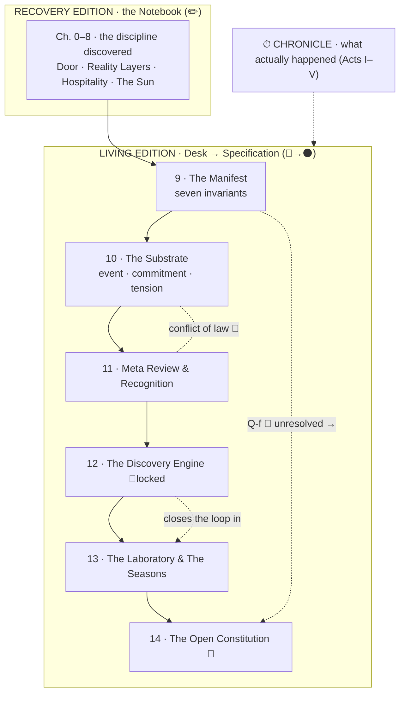

# The Brill Blueprint — Living Edition · Table of Contents

*The continuation of the book, front to back. mdBook-compatible: the nested list is a valid
`SUMMARY.md`. Chapter numbering continues from the [Recovery Edition](../recovery-edition/SUMMARY.md)
(Ch. 0–8).*

Medium key: `✏️` pencil (hypothesis) · `🔵` blue ink (survived challenge) · `⚫` black ink
(canonical) · `🟢` insight · `🔴` open tension · `⌫` erasure. See
[The Visual Epistemology](visual-language/00-epistemology.md).

---

## The knowledge map

---

## Front Matter
- [The Two Editions](front-matter/00-two-editions.md)
- [How to Read the Living Edition](front-matter/01-how-to-read.md)
- [Preface — The Book Continues](front-matter/02-preface.md)

## The Visual Epistemology *(the book's method of meaning)*
- [The Visual Epistemology](visual-language/00-epistemology.md) — `⚫`
- [The Maturation Gradient](visual-language/01-maturation-gradient.md) — `🔵`
- [Render Conventions](visual-language/02-render-conventions.md) — `⚫`
- [`theme.css`](visual-language/theme.css) — the palette for rich builds

## The Manuscript *(three layers: ▣ Technical · ◇ Human · ⏱ Chronicle)*
- [Chapter 9 · The Manifest](manuscript/09-the-manifest.md) — *the project governs itself; the seven invariants* · `🔵`
- [Chapter 10 · The Substrate](manuscript/10-the-substrate.md) — *the narrow waist; event · commitment · tension; lenses & views* · `🔵`
- [Chapter 11 · Meta Review & Recognition](manuscript/11-meta-review-and-recognition.md) — *making integration visible; recognition without privilege* · `🔵`
- [Chapter 12 · The Discovery Engine](manuscript/12-the-discovery-engine.md) — *commit · expose · consequence · remember — and the lock* · `✏️🔵`
- [Chapter 13 · The Laboratory & The Seasons](manuscript/13-the-laboratory-and-the-seasons.md) — *the discipline becomes executable; the loop first turns* · `🔵`
- [Chapter 14 · The Open Constitution](manuscript/14-the-open-constitution.md) — *the specification of what is not yet settled* · `✏️🔴`

## The Chronicle *(the third narrative layer — what actually happened)*
- [The Chronicle](chronicle/00-chronicle.md) — overview & how the journal is the record
- [Act I — Genesis](chronicle/01-genesis.md)
- [Act II — The Manifest Days](chronicle/02-the-manifest-days.md)
- [Act III — The Discovery Season](chronicle/03-the-discovery-season.md)
- [Act IV — The Laboratory](chronicle/04-the-laboratory.md)
- [Act V — The Recovery and the Fork](chronicle/05-the-recovery-and-the-fork.md)
- [Chronicle Log — the append-only forward record](chronicle/CHRONICLE-LOG.md)

## Apparatus
- [Glossary — Living Edition additions](apparatus/glossary-additions.md)
- [Provenance Map](apparatus/provenance-map.md)
- [Gaps & Horizon](apparatus/gaps-and-horizon.md)
- [Reading the Record — how to audit this book](apparatus/reading-the-record.md)

---

## The whole book, both editions

| | Recovery Edition | Living Edition |
|---|---|---|
| Chapters | [0–8](../recovery-edition/SUMMARY.md) | 9–14 (this file) |
| Register | notebook ✏️ | desk → specification 🔵→⚫ |
| Status | [sealed](../recovery-edition/SEAL.md) | living |

→ Sources of truth: [`/rfcs`](../../rfcs) · [`/research`](../../research) ·
[`/reviews`](../../reviews) · [`/journal`](../../journal) · [`ods`](../../ods)
