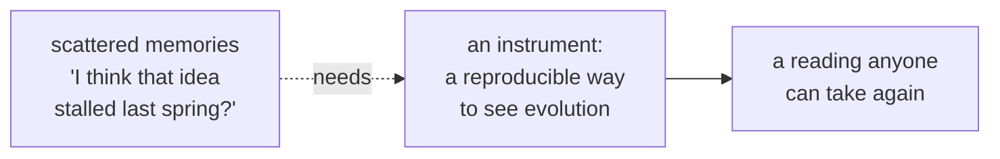

# Chapter 1 · Vision

```
Maturity  ✎──✎▸──▮──▣     this chapter reaches: ▮ Validation
          ▓▓▓▓▓▓▓▓░░░
```

> **Blueprint.** Organodynamics is *an engineering discipline for evolving representations of
> reality.* One line, and every word load-bearing. It is a discipline (it has rules and can be
> practiced), it is *engineering* (it builds and measures, not only contemplates), its subject
> is not reality but our *representations* of reality, and its concern is how those
> representations *evolve*. To watch evolution you need an instrument — and without one there
> is only anecdote.

---

The entire vision fits in the repository's oldest sentence, the one line of its README:

> **An engineering discipline for evolving representations of reality.**

It is worth slowing down on each word, because the discipline that follows is only these
words taken seriously.

**A discipline.** Not a theory, not a manifesto — a practice with rules that can be followed,
taught, and broken. It can be done well or badly. It has a method (challenge) and a source of
truth (the Record), both of which the later chapters make precise.

**Of engineering.** This is the surprising word. Representations of reality are usually the
business of philosophy or science, where the mood is contemplative. Organodynamics takes the
engineer's stance instead: it *builds* representations, it *measures* how they behave, and it
holds itself to the engineer's standard — reproducibility, versioning, restraint. The
discipline does not ask only "is this claim true?" It asks "how does this claim *behave over
time*, and can we watch it behave the same way twice?"

**Of evolving representations.** The object of study is deliberately second-order. Not reality
— representations *about* reality. And not representations frozen — representations *evolving*:
opened, challenged, matured, superseded, sometimes abandoned. The discipline is about the
*life* of claims, not their content alone.

**Of reality.** Behind all the representations stands the thing they are about, which the
discipline never lets itself confuse with them. That asymmetry — reality on one side,
everything we say about it on the other — becomes the book's deepest theme (Chapter 7). For
now, hold only this: representations are ours to revise; reality is not.

## Why an instrument is needed at all

A discipline about *evolving* representations needs a way to *see* evolution. Without one,

> there is only anecdote.

<!-- FIG-1.1 -->


You could try to run the discipline on memory and impression — *that idea felt stuck; this one
took off*. But impression is not reproducible, not comparable across people, and not honest
about its own errors. To make evolution an object you can study, you need an **instrument**:
something that turns the history of your representations into observations you can take again
and compare. Building that instrument well is the subject of Chapter 2, and it is harder than
it sounds, for a reason the vision already contains.

## Measurement is never neutral

Here the discipline states the conviction that shapes all its caution:

> Measurement in a soft domain is never neutral: what we choose to measure shapes what we
> make. The tooling *is* a theory of what matters.

This is why the instrument cannot be delegated to tooling as an afterthought. Choosing what to
measure is choosing what the discipline can *see* — and therefore what it will drift toward.
Measure activity, and people become active. Measure maturity, and people rush to look mature.
The measuring apparatus is not a neutral readout bolted onto the discipline; it is a *theory*
of what matters, and it must be designed with the same seriousness as the discipline itself.

> ✎ *margin* — keep this sentence. It is the seed of every prohibition in Chapter 2 and of the
> whole Observatory in Chapter 4. A discipline that forgets its instrument is opinionated will
> be quietly ruled by whatever its instrument happens to count.

## "Work in Progress" is a stance, not an apology

The README says two more words under the title: **Work in Progress.** In most projects that is
a disclaimer — *sorry, not finished yet.* Here it is the opposite: a **stance**. A discipline
about evolving representations could hardly present itself as a finished thing without
contradicting its own subject. The book you are reading is Work in Progress in exactly this
proud sense — it matures in view, it keeps what it used to believe, and it is never done. That
is not a weakness of the manuscript. It is the manuscript obeying its own discipline.

---

> ▮ **Take with you:** the vision is one sentence — *an engineering discipline for evolving
> representations of reality.* To study evolution you need an instrument; and because
> measurement is never neutral, designing that instrument is the discipline's founding act,
> not its plumbing.

---

### Provenance
- "An engineering discipline for evolving representations of reality"; "Work in Progress";
  "See /drafts" — **README**.
- The discipline's self-definition; the Instrument as first-class — **R1 §1**.
- "Without an instrument there is only anecdote"; "measurement … is never neutral"; "the
  tooling *is* a theory of what matters" — **R1 §2**.
- "Work in Progress" read as a stance — `[ed.]`.

### Navigate
← [Chapter 0 · The Door](00-the-door.md) · → [Chapter 2 · Organodynamics](02-organodynamics.md)
· concepts: **representation**, **Instrument**, **the Goodhart line** →
[Glossary](../apparatus/glossary.md)
