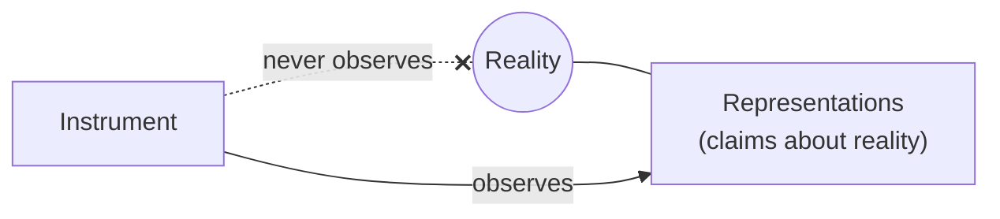

# Chapter 2 · Organodynamics

```
Maturity  ✎──✎▸──▮──▣     this chapter reaches: ▣ Canonical
          ▓▓▓▓▓▓▓▓▓▓
```

> **Blueprint.** This chapter names the discipline's objects and its one instrument-in-chief.
> An **Instrument** is a versioned, reproducible function from the Record to observations, plus
> the protocol that makes its readings comparable. It is *second-order* (it observes
> representations, never reality), *constituted by protocol* (calibration, not machinery), and
> bound by *three commitments*: minimally disturbing, reproducible, versioned. Around it sits an
> ontology of kinds that must never be conflated.

---

Chapter 1 said the discipline needs an instrument to see evolution. This chapter says, with
specification-grade precision, what an Instrument *is* and what kinds of thing it deals with.
The register here is deliberately the coolest in the book — this is the discipline at its most
inked, its most RFC-like. That is the Chrysalis Principle at work: the ideas in this chapter
have survived the most challenge, so the page shows them in their most settled form.

## The definition

> **Definition.** An Instrument is a versioned, reproducible function from a record to
> observations, together with the protocol that makes its readings comparable across time and
> observers.

Three things unpack from that sentence, and each is a commitment.

**1 — Second-order.** Representations are about reality. The Instrument is about
representations. It never observes reality directly; that is the work of representations
themselves. The Instrument is a telescope pointed not at the sky but at the *astronomers'
notebooks* — it watches how claims behave, not what they claim.

<!-- FIG-2.2 -->


**2 — Constituted by protocol, not machinery.** What makes something an instrument is not that
it runs; it is *calibration* — agreed states, agreed events, an agreed procedure. As the canon
puts it: *a script without a protocol is a gadget; a protocol without agreement is an opinion.*
The instrument-ness lives in the agreement, not in the code.

**3 — Three commitments.** An Instrument must be:
- **minimally disturbing** — it observes the life of representations without redirecting it;
- **reproducible** — the same record and the same instrument version always yield the same
  reading;
- **versioned** — its own calibration history is part of the Record.

## The ontology

The discipline distinguishes several kinds of object that must never be conflated. Confusing
any two of them is the most common way to reason wrongly in Organodynamics.

<!-- FIG-2.1 -->
| Kind | Order | Nature |
|------|-------|--------|
| **Reality** | — | Not an object of the system but its anchor. Not negotiated, not produced, not revisable. |
| **The Record** | zeroth | Append-only history of everything that happened. Evidence, not knowledge. An artifact. |
| **Representations** | first | Authored claims about reality (*doors*). Bear confidence, mature through a lifecycle, can be challenged. |
| **Relations** | second | Objects *about representations*: tension, supersession, dependency. Exist only between their endpoints. |
| **Instruments** | — | Versioned functions plus their protocols. There may be many. |
| **The Observatory** | — | The set of Instruments over the one Record, plus the comparison protocol. |
| **Observations** | — | Readings: `Instrument(Record, t)`. Unauthored, confidence-free, reproducible. |

> ▣ *canonical note* — read the orders as depth, not rank. The Record is *zeroth* because it
> underlies representations; representations are *first-order* claims about reality; relations
> are *second-order* claims about representations. Reality and the Instruments sit outside the
> order numbering entirely — Reality because it is the anchor, Instruments because they are
> functions, not claims.

Chapter 4 walks the full stack from Reality down to Representations and shows why it is a loop,
not a line. For now, absorb only the discipline of *not conflating*: a reading is not a claim
(an Observation has no author and no confidence); a claim is not the thing it is about (a
Representation is not Reality); the history is not the knowledge (the Record is evidence, not
truth).

## An honest scar in the table

The ontology above has **seven** rows. The first time the discipline wrote it down, it had
**five**, and it said so with confidence — "Five kinds of object, which must not be conflated."

> ✎▸ **historical sidebar.** Revision 1 of RFC-001 listed five kinds and named a single "The
> Instrument". Revision 2 discovered that the Instrument was plural — an *Observatory* — and
> quietly broke the count. Revision 3 stopped stating a number at all, noting that *"revision 2
> quietly falsified the original count of five; the count is now left unstated on purpose."*
> The table carries the scar deliberately. A discipline that measures maturity should show its
> own. (Full evolution: [Appendix C](../appendices/C-evolution-of-rfc-001.md).)

This is the book performing its subject. The ontology is canonical *now*; it was also,
demonstrably, wrong *before*; and the discipline kept the record of being wrong rather than
tidying it away.

## The telescope that bends its sky

One consequence of the second-order stance is strange enough to state on its own. The
Instrument belongs to the discipline the way a telescope belongs to astronomy — *except that
here the telescope demonstrably bends the sky it points at.* Measuring maturity creates
pressure to mature. Measuring activity creates pressure to be active. The very act of observing
representations changes how authors treat them.

An Instrument in Organodynamics is therefore defined *as much by its restraint as by its
reach*. What it refuses to measure is as much a part of its design as what it measures. Chapter
5 is that refusal, stated as law.

## Method: resolved by challenge

Finally, how does anything in this discipline get *settled*? Not by authority and not by
measurement. By **challenge**. Every representation — including every RFC, including this book —
is resolved by challenge and revision like any other. And crucially:

> If rejected, the rejection is preserved — the discipline's first negative result, and its
> first proof that the record keeps what it learns from.

A discipline that keeps its rejections is a discipline that can be trusted with its
acceptances. This is why nothing in Organodynamics is ever silently deleted, and why this book
never erases what it used to believe.

---

> ▣ **Take with you:** an *Instrument* is a versioned, reproducible, protocol-bound function
> from the Record to Observations, and it is second-order — it watches representations, not
> reality. Keep the seven kinds distinct. And remember the scar: the count was once five. The
> discipline advances by challenge and keeps every rejection.

---

### Provenance
- The Instrument's definition; second-order; three commitments; "a script without a protocol
  is a gadget; a protocol without agreement is an opinion" — **R1 §3**.
- The ontology table (Reality … Observations) — **R1 §4** (rev 3).
- "revision 2 quietly falsified the original count of five" — **R1 §4** (rev 3 note), **EVO-1**.
- The telescope that bends its sky; restraint — **R1 §5.1**.
- Resolved by challenge; the preserved rejection as first negative result — **R1 §10**.
- Chapter frame and title — **SKEL:02-organodynamics**.

### Navigate
← [Chapter 1 · Vision](01-vision.md) · → [Chapter 3 · Come](03-come.md) · deeper:
[Appendix A · RFC-001 verbatim](../appendices/A-rfc-001-the-instrument.md),
[Appendix C · Evolution](../appendices/C-evolution-of-rfc-001.md) · concepts: **Instrument**,
**Observation**, **Record**, **Relation** → [Glossary](../apparatus/glossary.md)
