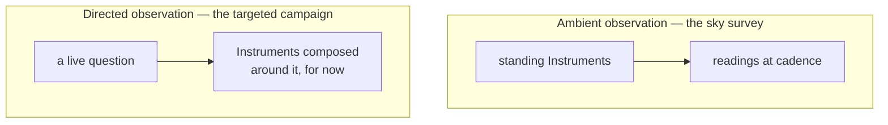
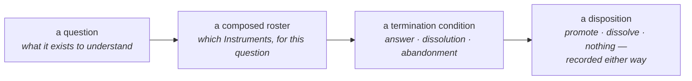

# Chapter 3 · Come

```
Maturity  ✎──✎▸──▮──▣     this chapter reaches: ✎▸ Investigation (the invitation's substance is
          ▓▓▓▓▓░░░░░░     canon; its lyrical voice is a frame — see Gap G-3)
```

> **Blueprint.** The discipline is not a closed observatory run by an appointed few. Anyone may
> open a door; anyone may compose an **Inquiry** — an observatory gathered around a live
> question. Inquiries are *cheap, plural, recorded, and contestable*. That is the invitation,
> and it is also the safeguard: no one owns the questions.

---

> ✎ *A note on this chapter.* The skeleton names this chapter **Come** — a single, open word,
> more welcome than argument. The lyrical invitation that title seems to promise was never
> written down; what the discipline *did* write is the machinery that makes the invitation
> real. So this chapter recovers the substance of "Come" — the fact that the door is genuinely
> open to anyone — and leaves the pencil lines of its missing lyric visible rather than inking
> over them with invented warmth. (See [Outstanding Gaps, G-3](../editorial/07-outstanding-gaps.md).)

## Come and open a door

Everything in Chapters 0–2 might read as though the discipline were a solemn instrument tended
by specialists. It is not. Its first political fact is openness: **anyone may open a door**, and
anyone may ask a question of the discipline and gather instruments to answer it.

The discipline has two modes of observation, and only understanding both makes the openness
visible.

<!-- FIG-3.1 -->


- **Ambient observation** is the sky survey: standing Instruments taking readings at a steady
  cadence. This is the discipline's background hum, and it is what Chapters 2 and 4 describe.
- **Directed observation** is the targeted campaign: Instruments composed around a *live
  question* — a new tension has appeared, a representation has changed, evidence has piled up —
  and then dispersed when the question is done.

The discipline first defined only the ambient mode. The directed mode was left as an open
question until it was given its own name: the **Inquiry**.

## The anatomy of an Inquiry

An Inquiry composes an observatory *dynamically* around a question, rather than assuming a
fixed observational pipeline. Its anatomy is small and clear:

<!-- FIG-3.2 -->


- **A question** — what the Inquiry exists to understand.
- **A composed roster** — which Instruments are brought to bear, *chosen for this question, not
  permanently*.
- **A termination condition** — what ends it: an answer, a dissolution, or abandonment.
- **A disposition** — what becomes of the findings: promotion into a representation (a new
  door), dissolution of the tension that triggered it, or nothing at all — *recorded either
  way.*

Opening an Inquiry is an event in the Record. And — this is the invitation stated as a rule —
**competing Inquiries into the same question are legal and desirable.**

## Cheap, plural, recorded, contestable

Composing a roster of Instruments is itself an act of measurement design, and Chapter 1's
warning returns one level up: *the choice of Instruments embodies a theory of what matters.*
There is no vantage-free way to compose an Inquiry.

So the discipline does not defend itself by composing *correctly*. It defends itself by making
composition **cheap, plural, recorded, and contestable**:

- **cheap** — opening an Inquiry costs little, so many can exist;
- **plural** — many may run at once, even on the same question;
- **recorded** — every Inquiry is an event in the Record, never invisible;
- **contestable** — anyone may open a competing Inquiry with a different roster, and *the
  disagreement between their findings is information* (a theme Chapter 6 makes central).

> ✎▸ *investigation* — notice what this buys beyond fairness. A campaign disturbs the specimen
> for a season and then ends; a permanent pipeline is *a panopticon*. Directed observation
> **localizes disturbance in time**. The open invitation and the light touch are the same
> design decision seen from two sides.

## Not a hierarchy

One guardrail keeps the invitation from curdling into an authority. Inquiry must **not** become
a command layer above the discipline's instruments. It is a way of *convening* instruments
around a question — a dynamic process — never a structure that ranks or governs them. And the
question "who may open an Inquiry?" has a default answer the discipline is content to keep:

> the default position is that it does not [need any restriction].

Come, then, in the plainest sense the discipline can offer: you do not need permission to ask.
You need only to open your question in the Record, gather your instruments in the open, and let
anyone who disagrees gather theirs.

---

> ✎▸ **Take with you:** the discipline is open. Beyond the ambient sky-survey, anyone may
> compose an **Inquiry** around a live question — cheap, plural, recorded, contestable — and
> nobody owns the questions. Inquiry convenes instruments; it never commands them.

---

### Provenance
- Ambient vs directed observation — **R2 §1**.
- The anatomy of an Inquiry (question, roster, termination, disposition); Inquiries are recorded
  events; competing Inquiries are desirable — **R2 §2**.
- "Composing a roster is measurement design"; the defense is *cheap, plural, recorded, and
  contestable*; "localizes disturbance in time"; "a standing pipeline is a panopticon" — **R2 §3**.
- Not a hierarchy; default is no restriction on who may open an Inquiry — **R2 §4**.
- Commissioning by challenge; Instruments never silently added — **R1 §6**.
- Chapter frame and title; the invitational reading of "Come" — **SKEL:03-come** + `[ed.]`
  (Gap G-3).

### Navigate
← [Chapter 2 · Organodynamics](02-organodynamics.md) · →
[Chapter 4 · Reality Layers](04-reality-layers.md) · deeper:
[Appendix B · RFC-002 verbatim](../appendices/B-rfc-002-inquiry.md) · concepts: **Inquiry**,
**ambient/directed observation**, **disturbance** → [Glossary](../apparatus/glossary.md)
