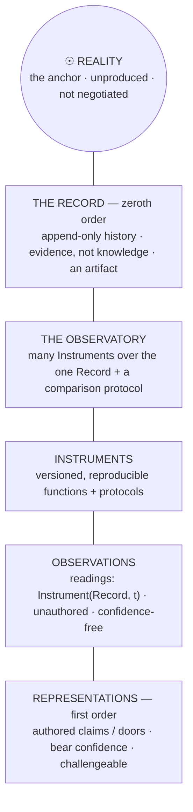
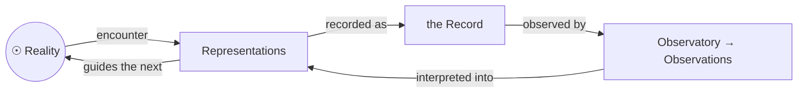
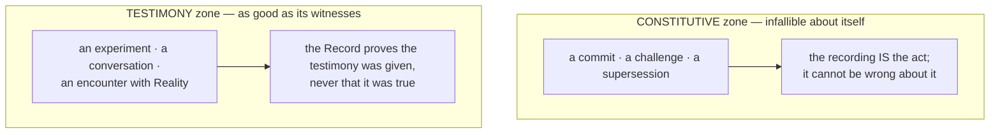
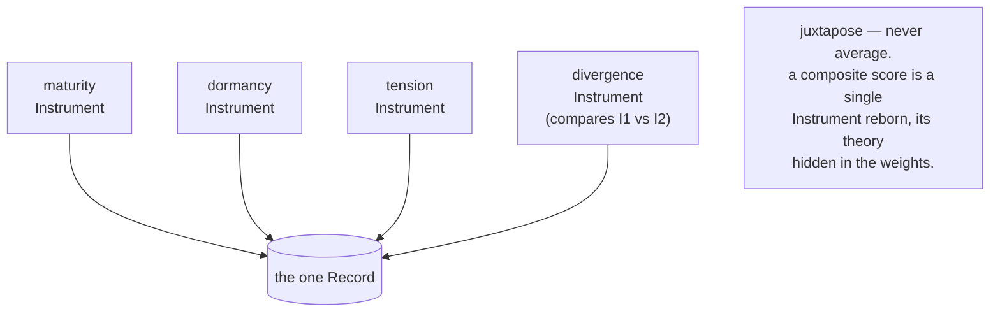

# Chapter 4 · Reality Layers

```
Maturity  ✎──✎▸──▮──▣     this chapter reaches: ▣ Canonical
          ▓▓▓▓▓▓▓▓▓▓
```

> **Blueprint.** Everything the discipline knows arranges into layers with one thing at the
> top that nothing else produces. From the anchor down: **Reality → the Record → the
> Observatory → Instruments → Observations → Representations.** But the geometry is a *loop, not
> a line* — it closes back on Reality, the only node nothing else makes. This chapter is the
> book's central spread; read it slowly.

---

This is the chapter the whole book leans on. It is also the chapter whose central claim the
discipline got *wrong once and corrected in the open* — so it is where the Chrysalis Principle
is most literally on display: a settled, inked hierarchy carrying the visible scar of the
belief it replaced.

## The stack

Here is the hierarchy, top to bottom. Read the top as the deepest invariant and the bottom as
the most revisable.

<!-- FIG-4.1 -->


- **Reality** is the anchor. It is not an object *of* the system; it is what the whole system
  is about. It is not negotiated, not produced by anything in the diagram, not revisable. It
  gets its own chapter ([Chapter 7 · The Sun](07-the-sun.md)).
- **The Record** is the append-only history of everything that happened — *evidence, not
  knowledge*. Crucially, it is an **artifact**: a representation of interactions with Reality,
  not Reality itself. Hold that; it is the correction this chapter is famous for.
- **The Observatory** is the set of Instruments over that one Record, plus the protocol that
  makes their readings comparable.
- **Instruments** are the versioned, reproducible functions of Chapter 2.
- **Observations** are their readings — unauthored, confidence-free, reproducible.
- **Representations** are the doors of Chapter 0 — authored, confidence-bearing, challengeable.

## A loop, not a line

Drawn as a stack, the hierarchy tempts you to read it as a one-way ladder: reality at top,
representations produced at the bottom. That reading is wrong, and the discipline corrects it
explicitly. Representations do not descend *only* from Observations. That path exists — an
interpreted reading can be promoted into a door (Chapter 0) — but it is the minor path.
Representations arise **chiefly from researchers encountering Reality directly**, and they
*guide the next encounter*. The geometry is a cycle:

<!-- FIG-4.2 -->


> ▣ **The defining property.** *Reality is the only element of the diagram that nothing else
> produces.* Every other node is made by the node before it. Reality is made by nothing. That
> is what *"not negotiated"* means, stated structurally rather than as a slogan.

## The Record has two zones

If the Record is only an artifact — only a witness — can it be *trusted*? The discipline's
answer is precise: the Record is trustworthy about some things absolutely and about others only
as far as its witnesses are. It has two zones.

<!-- FIG-4.4 -->


- **Constitutive events** are internal to the discipline — a commit, a challenge, a
  supersession. For these, *the recording is the act*: the Record cannot be wrong that a
  challenge occurred, because the challenge occurring *is* its being recorded.
- **Testimony events** are external — an experiment, a conversation, an encounter with Reality.
  For these, the Record proves only that the testimony was *given*, never that it was *true*.

So: *the Record is infallible only about itself; about Reality it is exactly as good as its
witnesses.* One elegant reframing falls out of this. The Record's append-only discipline — its
refusal to let the past be rewritten — is not a mere implementation convenience. It is an
**engineered homage** to the one property of Reality it can never possess: *what happened
cannot be renegotiated.* The Record cannot *be* Reality, so it is built to imitate Reality's
most important trait.

## One Record, many Instruments — the Observatory

Why is the *Observatory* a layer, and not just "the Instrument"? Because a single instrument
fails the discipline's own test. Chapter 1 held that the tooling is a theory of what matters. A
lone Instrument makes that theory *invisible and total*: whatever it does not measure, the
discipline cannot see, and there is no second vantage point from which the blindness could be
detected. In observational science you tell an artifact from a signal by **triangulation** —
instruments of different construction agreeing, or more usefully *disagreeing*. A lone
instrument cannot detect its own artifacts.

> **Definition.** An Observatory is a set of Instruments over a single shared Record, together
> with a comparison protocol — the rules that make readings from different Instruments
> juxtaposable without collapsing them onto one scale.

<!-- FIG-4.3 -->


The Observatory stays **flat, not towered**, for the reason Chapter 0 planted: a comparator
that takes other Instruments' readings as input is *itself just another function of the Record*
— another Instrument, not a higher kind. Everything roots in the one Record; there is no
upstairs. (The example roster above — maturity, dormancy, tension, and a divergence instrument
comparing the first two — is illustrative, not decided; the roster is a commissioning question.)

## Immutability, for free

One more property of this stack deserves its own line, because it turns a chore into a gift.
Should Observations be immutable? Yes — *and the discipline gets immutability for free rather
than by discipline.* If an Observation is a reproducible function of an immutable Record, then
any past reading can be **re-derived** from its coordinates: `(at-commit, instrument-version)`.
Nothing needs to be frozen, because nothing needs to be stored; editing an old reading is not
forbidden so much as *meaningless*.

The corollary governs how errors are fixed: you never correct a faulty reading — you
**recalibrate the Instrument**. A bug in the observing function is a calibration error; fix it,
bump the version, take a new reading. Both readings remain derivable forever, each honest about
which calibration produced it. This is also why a `STATE` file, if one ever exists in the
repository, is not a *document* but a *cache of the latest reading* — it must carry its
coordinates and must never be hand-edited.

## The scar this chapter carries

The stack was not always drawn this way.

> ✎▸ **historical sidebar — the correction at the heart of the book.** Revision 2 of RFC-001
> declared that *"the unity that matters is the Record"* — it placed the Record at the top and
> reasoned that one shared Record was the deepest invariant, "one sky, many telescopes."
> Revision 3 accepted a challenge and corrected it: *"the Record is not the deepest invariant.
> Reality is."* The Record was demoted to an artifact; Reality took the top of the stack; and
> the famous line was amended — *"one sky, many telescopes, and the sky was never the Record."*
> This is the single most important change in the discipline's short history, and the book
> keeps both states on purpose. See [Chapter 7](07-the-sun.md) and
> [Appendix C](../appendices/C-evolution-of-rfc-001.md).

---

> ▣ **Take with you:** the layers run **Reality → Record → Observatory → Instruments →
> Observations → Representations**, and they *loop* — closing on Reality, the one node nothing
> produces. The Record is only an artifact, infallible about itself and no better than its
> witnesses about Reality. The Observatory is many Instruments over one Record, juxtaposed
> never averaged. And it was once believed the Record sat at the top; it does not.

---

### Provenance
- The hierarchy Reality → Record → Observatory → Instruments → Observations → Representations;
  "a loop, not a line"; "Reality is the only element … nothing else produces"; the Record's two
  zones; "engineered homage" — **R1 §7**.
- The ontology of kinds — **R1 §4**.
- The Observatory defined; triangulation; "flat rather than towered"; no aggregation; the
  illustrative roster — **R1 §6**.
- Observations immutable for free; recalibrate the instrument; coordinates `(at-commit,
  instrument-version)` — **R1 §5.6**.
- `STATE` is a cached reading, not a document — **R1 §5.7**.
- *Superseded:* "the unity that matters is the Record" — **R1@rev2 §6**, **EVO-2**.
- Chapter frame and title — **SKEL:04-reality-layers**.

### Navigate
← [Chapter 3 · Come](03-come.md) · → [Chapter 5 · Personal Worlds](05-personal-worlds.md) ·
deeper: [Chapter 7 · The Sun](07-the-sun.md),
[Appendix C · Evolution](../appendices/C-evolution-of-rfc-001.md) · concepts: **Reality**,
**Record**, **Observatory**, **Observation**, **recalibration** →
[Glossary](../apparatus/glossary.md)
