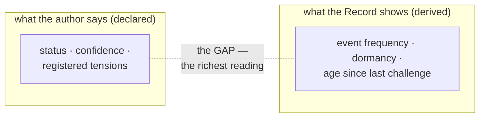

# Chapter 5 · Personal Worlds

```
Maturity  ✎──✎▸──▮──▣     this chapter reaches: ▮ Validation on doctrine; ✎▸ on the synthesis
          ▓▓▓▓▓▓▓░░░       (the "personal worlds" thesis is assembled, not quoted — see Gap G-5)
```

> **Blueprint.** A representation is *authored*. It bears its author's declared confidence. Yet
> the discipline measures the representation and *never the author* — no per-author metrics, of
> any kind, ever. Each researcher tends a personal world of confidence-bearing claims; the
> discipline studies the claims and protects the person, because the moment confidence reads as
> a competence score, honest uncertainty dies.

---

> ✎ *A note on this chapter.* The skeleton titles this chapter **Personal Worlds**. The canon
> supports every *piece* of the idea — that representations are authored, that they carry a
> personal declaration of confidence, that the person must be shielded from measurement — but
> it never assembles them into a single "personal worlds" thesis. This chapter does that
> assembly and marks it as investigation-stage, not settled doctrine. (See
> [Outstanding Gaps, G-5](../editorial/07-outstanding-gaps.md).)

## Every door has an author

Return to the door. Chapter 0 said a representation is *authored* — someone opened it. That is
not incidental bookkeeping; it is what separates a representation from an observation. An
**Observation** is unauthored and confidence-free: the Instrument produced it, and it makes no
claim. A **Representation** is the opposite: a person made it, and it *bears confidence* — it
says, out loud, how sure its author is.

So the discipline is populated by people, each holding a set of claims about reality, each
claim tagged with a declared confidence. Call that set a **personal world**: not a private one
— the doors are open to all — but a *personal* one, in that its confidences are somebody's own
honest estimate, not a committee's verdict.

<!-- FIG-5.1 -->


## The two channels, and the gap between them

The discipline observes each representation through two channels, and this chapter is the human
meaning of that pair. There are **declared observables** — what the author *asserts*: status,
confidence, registered tensions. And there are **derived observables** — what the Record
*implies* regardless of assertion: how often the door is touched, how long it has been dormant,
how long since it was last challenged.

The single most important reading in the whole discipline lives in the **gap** between them: a
door *declared* load-bearing but *behaviorally* dormant and long unchallenged. Neither channel
alone can produce that reading. And notice what it is not: it is not a judgment of the author.
It is a fact about a claim — that its declared importance and its lived behavior have drifted
apart. That drift is a lamp pointed at the *representation*, never at the person who opened it.

## The first prohibition: never measure people

Here the discipline draws its hardest line, and this chapter exists to state it in full:

> **The specimen is the representation, never the author.** No per-author metrics of any kind.
> The moment confidence declarations read as competence scores, honest uncertainty dies, and
> with it the discipline.

This is not politeness; it is survival. The discipline runs on honest declarations of
confidence. "I am not sure about this" is one of its most valuable inputs — it is what makes the
gap-reading possible, what invites challenge, what keeps a shaky door from being trusted. Now
imagine confidence declarations were aggregated per person into a score. Instantly, admitting
uncertainty becomes admitting incompetence, and every author learns to declare high confidence
whether they feel it or not. The input that the discipline most needs would be the input it had
taught everyone to fake. So it forbids the measurement outright — not "discourages", forbids.

> ▮ *the personal world stays personal.* Because no one is scored, a researcher can hold a
> world full of tentative, half-sure, openly-uncertain doors without cost. That freedom is the
> soil the whole discipline grows in.

## Merit is not measured either

A neighboring prohibition guards the same freedom from a different side. The Instrument measures
*state and movement, never quality*. There are no scores, no rankings of representations by
goodness. **Merit is adjudicated by challenge** — a discourse — not read off a dial. A
representation earns standing by surviving people pushing on it, not by scoring well on a
metric. This keeps two things the discipline needs carefully apart: *how a door is behaving*
(observed) and *whether a door is any good* (challenged). Confuse them and you are back to
scoring people by proxy.

## Why this chapter is investigation-stage

Everything above is inked doctrine — the prohibitions are canon, the two channels are canon,
the gap is canon. What is *not* directly quoted from the canon is the framing that ties them
together: the image of each researcher as the keeper of a personal world. That image is the
editor's honest reading of the chapter's title, assembled from canonical parts. It is offered
in the discipline's own spirit — as a claim that could be *promoted* into a door and challenged
like any other — not as settled law. The pencil in this chapter's maturity bar is that
synthesis, kept visible on purpose.

---

> ▮ **Take with you:** a representation is authored and confidence-bearing; the discipline
> measures the representation and *never* the author, and never ranks representations by merit.
> The richest reading is the *gap* between what an author declares and how their door actually
> behaves — a lamp on the claim, never on the person. Protecting honest uncertainty is not
> kindness; it is the condition of the discipline's survival.

---

### Provenance
- Representations are authored, bear confidence, mature — **R1 §4**, **R1 §3**.
- Declared vs derived observables; the gap between them is the richest reading — **R1 §5.2**.
- "The specimen is the representation, never the author"; no per-author metrics; honest
  uncertainty dies if confidence reads as a competence score — **R1 §5.3** (prohibition 1).
- Merit is adjudicated by challenge, never measured — **R1 §5.3** (prohibition 2).
- The Instrument defined by restraint as much as reach — **R1 §5.1**.
- Chapter frame and title; the "personal worlds" synthesis — **SKEL:05-personal-worlds** +
  `[ed.]` (Gap G-5).

### Navigate
← [Chapter 4 · Reality Layers](04-reality-layers.md) · →
[Chapter 6 · Hospitality](06-hospitality.md) · concepts: **confidence**, **declared/derived
observables**, **the gap**, **merit**, **the Goodhart line** →
[Glossary](../apparatus/glossary.md)
