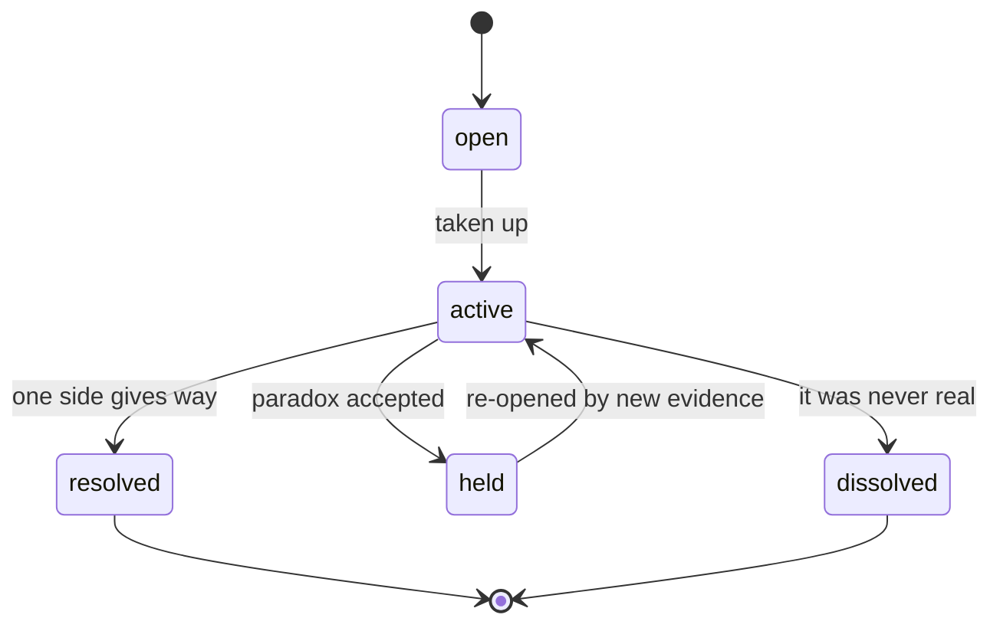
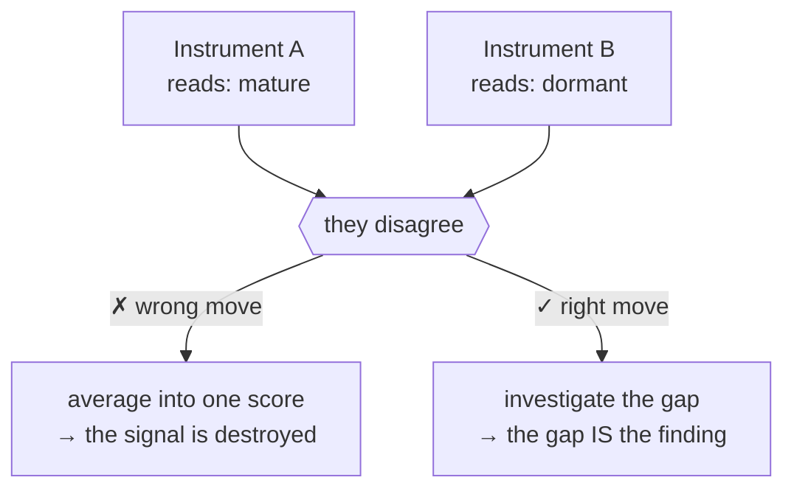

# Chapter 6 · Hospitality

```
Maturity  ✎──✎▸──▮──▣     this chapter reaches: ▣ Canonical
          ▓▓▓▓▓▓▓▓▓▓
```

> **Blueprint.** The discipline does not merely tolerate disagreement — it is *built to feed on
> it.* A **tension** between two doors is a first-class object with its own life; a held
> tension (an accepted paradox) is the discipline's most generative organ; and the deepest law
> of the whole system is three words: **disagreement is information.** To average conflict away
> is to destroy the very signal the discipline exists to produce.

---

Most systems treat disagreement as friction to be minimized — a conflict to resolve, a variance
to average out, a queue to clear. Organodynamics treats it as the opposite: as its richest raw
material. This chapter is the discipline's theory of hospitality — how it *receives* conflict,
at every level, and metabolizes it into knowledge.

## Tension is a kind of thing

When two doors pull against each other, the pull is not a defect in either door. It is its own
object — a **relation** called a **tension**. A tension is second-order: it exists *only between
its two endpoints* and has no meaning alone. It is not about reality; it is about two
representations.

But a tension is *claim-like* — a declared tension can be *wrong*. Two doors that look
incompatible may, under refinement, turn out to agree. So a tension has a lifecycle of its own,
and that lifecycle needs a state that mere "resolution" cannot express:

<!-- FIG-6.1 -->


The unusual state is **dissolved** — the tension was *apparent, not real.* A dissolved tension
is not an embarrassment to be deleted; it is *data*. It teaches what looked incompatible and
wasn't, and the discipline keeps it for exactly that lesson.

## The held tension: the generative organ

The most important state is **held** — the accepted paradox. Sometimes two doors genuinely
resist each other and neither gives way, and the discipline chooses to *hold* the tension
rather than force a false resolution. A held tension quietly asserts something about reality:
that reality, *as currently representable*, sustains both poles.

That assertion borders on being a representation itself — and it is *often the birthplace of
one*. A held tension is the strongest possible signal that the current representational
vocabulary is inadequate: the words we have cannot yet say the thing that would dissolve the
paradox. So the discipline names tension its **generative organ** — the place where new
representations are most often conceived.

> ▣ *canonical note.* There is an open sub-question here the discipline has not closed: should
> *holding* a tension **require** opening a door for the representation that would dissolve it?
> The book leaves it open, as the canon does (see [Chapter 8](08-open-questions.md)).

## The deepest law: disagreement is information

Now raise the same idea from doors to instruments, and you reach the constitutional heart of
the discipline. When two Instruments in the Observatory disagree, what should you do? The
tempting engineering answer is to combine their readings into a single number. The discipline
forbids it:

> **No aggregation — because disagreement is information.** The Observatory juxtaposes readings;
> it never combines them into a scalar. When two Instruments disagree, the first objective is
> never to average their outputs but to *understand why they diverge* — the gap is a phenomenon
> to investigate, not noise to suppress. Averaging destroys exactly the information the
> Observatory exists to produce.

<!-- FIG-6.2 -->


This is why a composite score is dangerous: it is *a single Instrument reborn, its theory of
what matters hidden inside the weights.* The famous failure mode — measures becoming targets,
the Goodhart line — is *merely what punishes the discipline that forgets this.* The prohibition
on aggregation is not defensive housekeeping; it is the same principle that made tension
generative among doors, now operating among instruments. **The discipline metabolizes
disagreement into knowledge, at every level.**

> ✎▸ **historical sidebar.** This law arrived in two steps. Revision 2 of RFC-001 stated "no
> aggregation" and justified it *defensively* — as a guard against Goodhart. Revision 3 accepted
> a challenge and reversed the order of justification: the real reason is *constitutional*,
> "disagreement is information", and Goodhart is only the penalty for forgetting it. The book
> keeps both framings; the deepening is itself part of the knowledge. See
> [Appendix C](../appendices/C-evolution-of-rfc-001.md).

## Hospitality as a design, not a mood

Hospitality here is structural, not sentimental. Recall from Chapter 3 that Inquiries are cheap,
plural, and contestable, and that a directed campaign *localizes disturbance in time* — "a
standing pipeline is a panopticon." That, too, is hospitality: the discipline welcomes competing
investigations of the same question and lets their disagreement stand as a result, rather than
appointing one pipeline to pronounce the answer. Independence of perspective is protected on
purpose; a fixed roster of predictable voices would be *aggregation by another name.*

The through-line of the whole chapter is a single reversal of instinct. Where other systems ask
"how do we reduce disagreement?", Organodynamics asks "what is this disagreement *telling* us?"
— and builds every layer, from the tension between two doors to the divergence between two
instruments, to keep that question askable.

---

> ▣ **Take with you:** a **tension** is a first-class relation with its own life; a **held**
> tension is where new representations are born; and across the whole discipline, **disagreement
> is information** — never to be averaged away. Goodhart is only the punishment for forgetting
> it. Hospitality toward conflict is the engine, not the etiquette.

---

### Provenance
- Tension as a relation; lifecycle open/active/resolved/held/**dissolved**; "a dissolved
  tension is data"; the held paradox as generative organ; the open sub-question about holding —
  **R1 §5.5**.
- "No aggregation — because disagreement is information"; averaging destroys the signal; a
  composite score is a single Instrument reborn; Goodhart as the penalty; independence of
  perspective vs a fixed roster — **R1 §6**, **R1 §9 (Q-i)**.
- Inquiry localizes disturbance; "a standing pipeline is a panopticon" — **R2 §3**.
- The deepening of the aggregation argument across revisions — **EVO-2**.
- Chapter frame and title — **SKEL:06-hospitality**.

### Navigate
← [Chapter 5 · Personal Worlds](05-personal-worlds.md) · → [Chapter 7 · The Sun](07-the-sun.md)
· concepts: **tension**, **held/dissolved**, **aggregation**, **the Goodhart line**,
**Observatory** → [Glossary](../apparatus/glossary.md)
